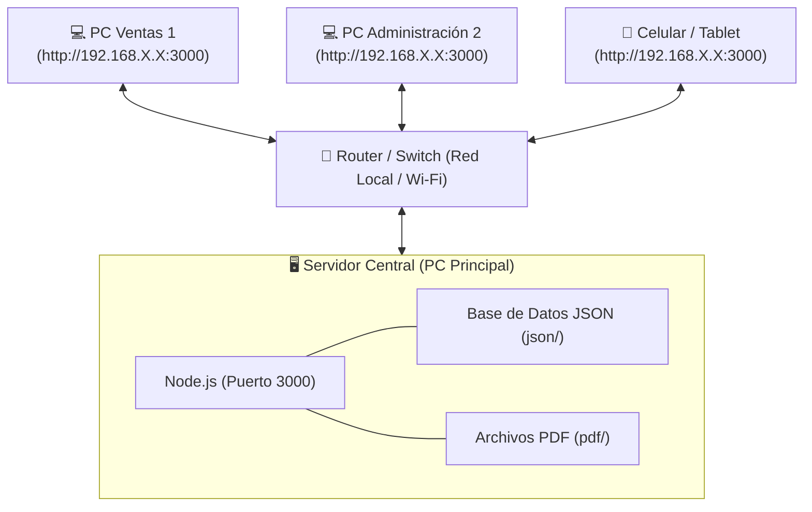

# 🌐 Guía de Instalación y Despliegue en Red Local (LAN / Wi-Fi)
## Sistema Cotizador - Depósito de Flejes San Martín

Esta guía explica detalladamente cómo instalar y configurar el sistema en la computadora que funcionará como **Servidor Principal**, y cómo acceder a él desde cualquier otro computador, celular o tablet conectado a la misma red local (oficina o taller).

---

## 🏗️ 1. Arquitectura de Red



- **Un solo servidor central**: Guarda todas las cotizaciones, clientes, productos y genera los PDFs.
- **Acceso multiusuario simultáneo**: Todos los vendedores y administradores ven y modifican la misma información en tiempo real desde sus propios navegadores web.

---

## 📋 2. Requisitos en la Máquina Servidor

1. **Sistema Operativo**: Windows 10, Windows 11 o Windows Server (64-bit).
2. **Node.js LTS**: Descargar e instalar la versión LTS desde [nodejs.org](https://nodejs.org/).
   - Durante la instalación, dejar marcadas todas las opciones por defecto y finalizar.
3. **Conexión de Red**: Conectado preferiblemente por cable de red (Ethernet) o Wi-Fi estable a la red local de la empresa.

---

## 🚀 3. Instalación y Puesta en Marcha

### Paso 1: Copiar la Carpeta del Sistema
Copie la carpeta completa del proyecto `Cotizador` en una ubicación fija del Servidor, por ejemplo:
`C:\Cotizador` o en el Escritorio del usuario principal.

### Paso 2: Ejecutar el Servidor
Haga doble clic sobre el archivo:
📁 **`Iniciar_Cotizador.bat`**

El script realizará automáticamente:
1. Verificación de Node.js instalado.
2. Descarga e instalación automática de librerías (`node_modules`) si es la primera vez.
3. Apertura automática del navegador en `http://localhost:3000`.
4. Muestra en pantalla la **dirección IP de red** asignada (ejemplo: `http://192.168.1.50:3000`).

---

## 🛡️ 4. Configuración del Firewall de Windows (Paso Crítico)

Para que los otros computadores de la red puedan conectarse al servidor, se debe permitir el tráfico de entrada por el puerto **3000**.

### Opción A: Vía Comando Rápido (Recomendado - 5 Segundos)
1. Presione la tecla **Windows**, escriba **PowerShell** o **CMD**.
2. Haga clic derecho y seleccione **"Ejecutar como Administrador"**.
3. Pegue el siguiente comando y presione **Enter**:

```cmd
netsh advfirewall firewall add rule name="Cotizador Servidor (Puerto 3000)" dir=in action=allow protocol=TCP localport=3000
```
> Si el comando responde `Aceptar` o `Ok`, el puerto ya quedó abierto y protegido para la red.

### Opción B: Vía Interfaz Gráfica de Windows
1. Abra el **Panel de Control** > **Firewall de Windows Defender** > **Configuración avanzada**.
2. En el panel izquierdo, haga clic en **Reglas de entrada** y luego en **Nueva regla...** (panel derecho).
3. Seleccione **Puerto** > Siguiente.
4. Seleccione **TCP** y en *Puertos locales específicos* escriba: `3000` > Siguiente.
5. Seleccione **Permitir la conexión** > Siguiente.
6. Deje marcados *Dominio, Privado y Público* > Siguiente.
7. Nombre: `Cotizador Port 3000` > Finalizar.

---

## 📌 5. Fijar la Dirección IP del Servidor (Recomendado)

Para evitar que el router cambie la dirección IP del servidor al reiniciar, se recomienda asignarle una IP fija:

1. **Método 1 (Configuración de Windows)**:
   - Abra *Configuración* > *Red e Internet* > *Ethernet / Wi-Fi*.
   - En *Asignación de IP*, cambie de *Automático (DHCP)* a *Manual*.
   - Active **IPv4** y asigne:
     - IP: Ejemplo `192.168.1.100`
     - Máscara de subred: `255.255.255.0`
     - Puerta de enlace: `192.168.1.1` (la de su router)
     - DNS: `8.8.8.8` y `1.1.1.1`
2. **Método 2 (Reserva DHCP en el Router)**:
   - Ingrese al panel del router de la empresa y configure una "Reserva de IP" (Static Lease) para la dirección MAC del computador servidor.

---

## 💻 6. Acceso desde otros Equipos Clientes (Vendedores / Administración)

Desde cualquier otro computador, celular o tablet conectado a la misma red:

1. Abra cualquier navegador web (Google Chrome, Microsoft Edge, Firefox, Safari).
2. En la barra de direcciones escriba la IP del servidor con el puerto 3000:
   ```text
   http://192.168.1.100:3000
   ```
   *(Reemplace `192.168.1.100` por la IP real que mostró la consola del servidor).*

### Crear Acceso Directo en el Escritorio de los Clientes:
1. En el navegador del cliente, presione el menú de opciones (tres puntos `...`).
2. Vaya a **Guardar y compartir** / **Más herramientas** > **Crear acceso directo...** o **Instalar esta página como aplicación**.
3. Marque la casilla *"Abrir como ventana"* y haga clic en **Crear**.
4. Ahora tendrá un ícono del Cotizador en su escritorio como si fuera un programa nativo.

---

## 🔄 7. Inicio Automático con Windows (Sin Intervención Humana)

Para que el servidor se inicie automáticamente cada vez que se encienda la computadora:

1. Presione las teclas `Windows + R`, escriba `shell:startup` y presione Enter.
2. Se abrirá la carpeta de inicio de Windows:
   `C:\Users\[Usuario]\AppData\Roaming\Microsoft\Windows\Start Menu\Programs\Startup`
3. Cree un **Acceso Directo** del archivo `Iniciar_Cotizador.bat` y péguelo en esa carpeta.
4. Listo. Cada vez que prenda el computador, el servidor arrancará solo.

---

## ❓ 8. Preguntas Frecuentes y Solución de Problemas

| Problema | Causa Probable | Solución |
| :--- | :--- | :--- |
| **"No se puede acceder a este sitio" desde otra PC** | El Firewall de Windows está bloqueando el puerto 3000. | Ejecute el comando del Paso 4 como Administrador en el servidor. |
| **La red de Windows está en modo "Público"** | Windows bloquea conexiones entrantes en redes marcadas como públicas. | Cambie la red a "Privada" en: *Configuración de Windows > Red e Internet > Propiedades > Red Privada*. |
| **El servidor cambió de IP** | El router reinició y asignó una nueva IP por DHCP. | Revise la ventana negra de `Iniciar_Cotizador.bat` para ver la nueva IP, o configure IP estática según el Paso 5. |
| **No se pueden descargar PDFs** | Permisos de carpeta en el servidor. | La carpeta `pdf/` y `json/` deben tener permisos de lectura y escritura para el usuario de Windows. |
