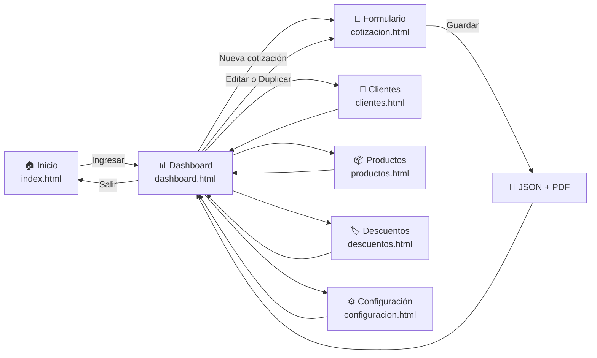

# Cotizador — Depósito de Flejes San Martín

> Aplicación **local** para crear, guardar, editar, duplicar, anular e imprimir cotizaciones de materiales de construcción y ornamentación.  
> Corre en tu computadora — no necesita internet ni servicios en la nube para funcionar.

---

## ¿Qué hace este proyecto?

```
┌─────────────────────────────────────────────────────────────────────────────┐
│                       COTIZADOR FLEJES SAN MARTÍN                           │
├─────────────────────────────────────────────────────────────────────────────┤
│                                                                             │
│   👤 Clientes          📦 Productos         🏷️ Descuentos                   │
│   ───────────          ────────────         ─────────────                   │
│   Directorio de        Catálogo con         Reglas automáticas por          │
│   contactos y NIT      alerta de stock      cliente o producto              │
│                                                                             │
│   📄 Cotizaciones      💰 Impuestos         ⚙️ Configuración                │
│   ───────────────      ────────────         ────────────────                │
│   Crear, editar,       IVA + Retefuente     SMTP, WhatsApp y                │
│   duplicar y anular    Anticipo 50/50       Respaldos automáticos           │
│                                                                             │
│                         ┌──────────────┐                                    │
│                         │  Genera PDF  │                                    │
│                         │  vectorial   │                                    │
│                         └──────────────┘                                    │
│                                                                             │
└─────────────────────────────────────────────────────────────────────────────┘
```

| Característica | Descripción |
|----------------|-------------|
| **Cotizaciones** | Presupuestos con folio secuencial (`COT-2026-0001`), tabla de 5 columnas optimizada (sin columna innecesaria de unidad) y versionado |
| **Impuestos y Retención** | Cálculo de IVA (19%) y Retención en la fuente (Retefuente) con interruptores individuales y atenuación visual limpia sin tachados |
| **Anticipo y Saldo (50/50)** | Desglose institucional no editable del 50% anticipo para iniciar y 50% saldo contra entrega, reflejado en tarjeta automática y en el PDF |
| **Clientes** | Catálogo opcional para autocompletar nombre, NIT, teléfono, correo y dirección |
| **Productos** | Catálogo de materiales con precio unitario, control de existencias y alerta visual de stock mínimo |
| **Descuentos** | Matriz de porcentajes automáticos por cliente (subtotal) o por producto (línea) |
| **PDF Membretado** | Documento vectorial A4 descargable con layout anti-traslapes (112mm), desglose del 50% y guardado en `/pdf/` |
| **Despacho Omnicanal** | Compartir por WhatsApp Web (con prefijo Colombia `57`) y envío por correo SMTP con PDF adjunto |
| **100% Local y Seguro** | Datos en archivos JSON con persistencia atómica tolerante a Windows y respaldos en `/respaldos/` |

---

## Flujo de la aplicación



### Paso a paso para el usuario

```
 1. Doble clic en "Iniciar_Cotizador.bat" o abrir http://localhost:3000
          │
          ▼
 2. Pantalla de bienvenida → clic en "Ingresar al cotizador"
          │
          ▼
 3. Dashboard → ver cotizaciones existentes, métricas y stock bajo
          │
          ├──► "+ Nueva cotización" → llenar formulario → Guardar y descargar PDF
          │         │
          │         └──► Genera PDF membretado + se respalda en json/ y pdf/
          │
          ├──► Enviar por WhatsApp o Correo SMTP al cliente
          │
          ├──► Duplicar cotización (crea copia con nuevo folio)
          │
          ├──► Clientes / Productos / Descuentos → administrar catálogos
          │
          └──► Configuración → valores por defecto de IVA/Retefuente, SMTP y respaldos
```

---

## Estructura de carpetas

```
Cotizador/
│
├── 📄 server.js                  ← Servidor principal (Express.js)
├── 📄 Iniciar_Cotizador.bat     ← Lanzador de un clic para Windows (sin consola)
├── 📄 package.json               ← Dependencias y scripts de Node
├── 📄 SERVIDOR.md                ← Esta guía
├── 📄 README.md                  ← Resumen del proyecto
│
├── 📁 public/                    ← Interfaz web (servida en http://localhost:3000)
│   ├── index.html                ← Pantalla de bienvenida (Landing page)
│   ├── dashboard.html            ← Panel de ventas y lista de cotizaciones
│   ├── cotizacion.html           ← Creador y editor de cotizaciones
│   ├── clientes.html             ← Directorio de clientes
│   ├── productos.html            ← Catálogo de materiales e inventario
│   ├── descuentos.html           ← Matriz de reglas de descuento
│   ├── configuracion.html        ← Ajustes de IVA, Retefuente, WhatsApp y SMTP
│   ├── css/                      ← Hojas de estilo modulares (variables, layout, componentes)
│   ├── fonts/                    ← Tipografías vectoriales Roboto para jsPDF
│   ├── image/                    ← Recursos gráficos (logo institucional, favicon)
│   └── js/                       ← Controladores JavaScript del frontend
│       ├── api.js                ← Cliente HTTP centralizado
│       ├── dashboard.js          ← Panel de ventas, filtros y métricas
│       ├── cotizacion.js         ← Formulario principal y cálculo de impuestos
│       ├── clientes.js           ← Gestión de clientes
│       ├── productos.js          ← Catálogo de productos y stock
│       ├── descuentos.js         ← Reglas de descuento
│       ├── configuracion.js      ← Parámetros del sistema
│       ├── pdf.js                ← Motor vectorial de generación de PDF
│       └── ui.js                 ← Utilidades de interfaz y formato (es-CO)
│
├── 📁 json/                      ← Persistencia local en archivos JSON
│   ├── cotizaciones.json
│   ├── clientes.json
│   ├── productos.json
│   ├── descuentos.json
│   └── configuracion.json
│
├── 📁 pdf/                       ← PDFs generados y guardados en el servidor
│   └── COT-2026-0001.pdf
│
├── 📁 respaldos/                 ← Copias de seguridad automáticas y manuales
│   └── respaldo-YYYY-MM-DD...json
│
└── 📁 specs/                     ← Suite de especificaciones técnicas (01 a 06)
```

---

## API del servidor

El servidor expone estos endpoints en `http://localhost:3000`:

| Método | Ruta | Acción |
|--------|------|--------|
| `GET` | `/api/cotizaciones` | Listar cotizaciones (ordenadas por fecha descendente) |
| `GET` | `/api/cotizaciones/:id` | Obtener detalle de una cotización |
| `POST` | `/api/cotizaciones` | Crear cotización nueva con folio secuencial |
| `POST` | `/api/cotizaciones/:id/duplicar` | Duplicar cotización existente con nuevo folio |
| `PUT` | `/api/cotizaciones/:id` | Actualizar cotización (guarda historial de versiones) |
| `DELETE` | `/api/cotizaciones/:id` | Anulación lógica de la cotización (soft-delete) |
| `GET/POST/PUT/DELETE` | `/api/clientes` | CRUD completo de clientes |
| `GET/POST/PUT/DELETE` | `/api/productos` | CRUD completo de materiales de catálogo |
| `GET` | `/api/inventario/alertas` | Consulta de productos con stock en o bajo el mínimo |
| `GET/PUT` | `/api/descuentos` | Consulta y guardado de matriz de descuentos |
| `GET/PUT` | `/api/configuracion` | Consulta y actualización de ajustes e impuestos |
| `POST` | `/api/respaldos` | Generar snapshot manual de respaldo |
| `POST` | `/api/correo/enviar` | Despacho de cotización con PDF adjunto por SMTP |
| `POST` | `/api/pdf` | Guardar archivo PDF en la carpeta `/pdf/` |
| `GET` | `/pdf/:archivo` | Servir o descargar un PDF guardado |

---

# Servidor local — Iniciar y detener

El Cotizador necesita Node.js corriendo en tu computadora en el puerto **3000**.

---

## Iniciar el servidor

### Opción 1 — Doble clic en Windows (Recomendada para cualquier usuario)
Haga doble clic en el archivo:
```
Iniciar_Cotizador.bat
```
* Verifica que Node.js esté instalado.
* Si es la primera vez, instala las dependencias automáticamente.
* Inicia el servidor y abre el navegador en `http://localhost:3000`.

### Opción 2 — Desde la terminal con npm
```bash
cd Cotizador
npm start
```

### Opción 3 — Directamente con Node
```bash
cd Cotizador
node server.js
```

---

## Detener el servidor

- Si usó la terminal o la ventana de `Iniciar_Cotizador.bat`: presione **Ctrl + C** o simplemente cierre la ventana.
- Si el puerto 3000 quedó ocupado por error, ejecute en **PowerShell**:
```powershell
Get-NetTCPConnection -LocalPort 3000 -ErrorAction SilentlyContinue |
  ForEach-Object { Stop-Process -Id $_.OwningProcess -Force }
```

---

## Problemas frecuentes

| Problema | Causa probable | Solución |
|----------|----------------|----------|
| `EADDRINUSE :::3000` | Puerto 3000 ocupado | Cerrar otra instancia o usar el comando PowerShell de forzar detención |
| La página no carga | Servidor detenido | Hacer doble clic en `Iniciar_Cotizador.bat` o ejecutar `npm start` |
| `No se encontró Node.js` | Node.js no instalado | Descargar e instalar desde [nodejs.org](https://nodejs.org/) |
| Correo no envía | Datos SMTP incorrectos | Usar los botones de preconfiguración (Gmail/Outlook) y generar una contraseña de aplicación |
| WhatsApp abre número erróneo | Teléfono incompleto | Escribir los 10 dígitos del celular; el sistema antepone automáticamente el código `57` |
